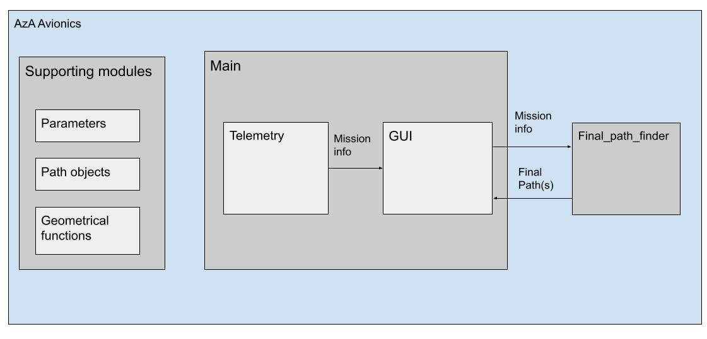
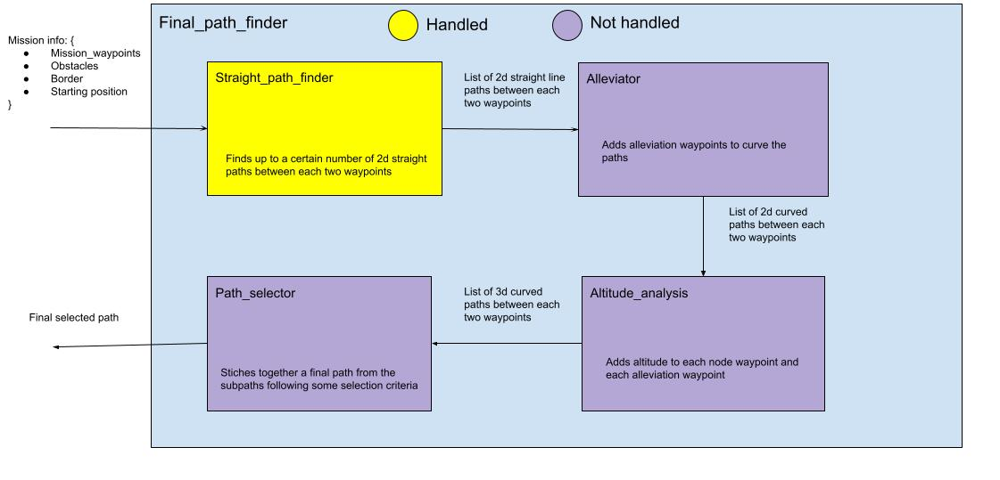

# AzA_Avionics  
Code of the Avionics team at the Arizona Autonomous Vehicles Club  
  
Python code that handles server communications and autonomous flying of the club's plane  
  
Status:  
> • Server communications - Not handled  
> • Decision making - Not handled  
> • Pathfinding - Only 2d straight line pathfinding  

GUI instructions:  
> • Click on the dots in the selection menu up-left to go into mission_waypoint(blue)/obstacle(white)/border(yellow) input mode  
> • For waypoints and border vertices, click once to place them. Click on a waypoint/border_vertex to select it for placing a waypoint/border_vertex after it  
> • For Obstacles, click at where you want the obstacle to be, then drag to select the radius  
> • To delete any object (waypoint/obstacle/border_vertex), right click on it  
> • To delete all objects of a certain type, right click on the dot in thee selection menu that corresponds to it
> • The current algorithm will show two possible paths for each two waypoints in different colors. That color itself alternates for the same path between waypoints  
> • If no path can be found, you will get a message in the console "Error: no path found"  

