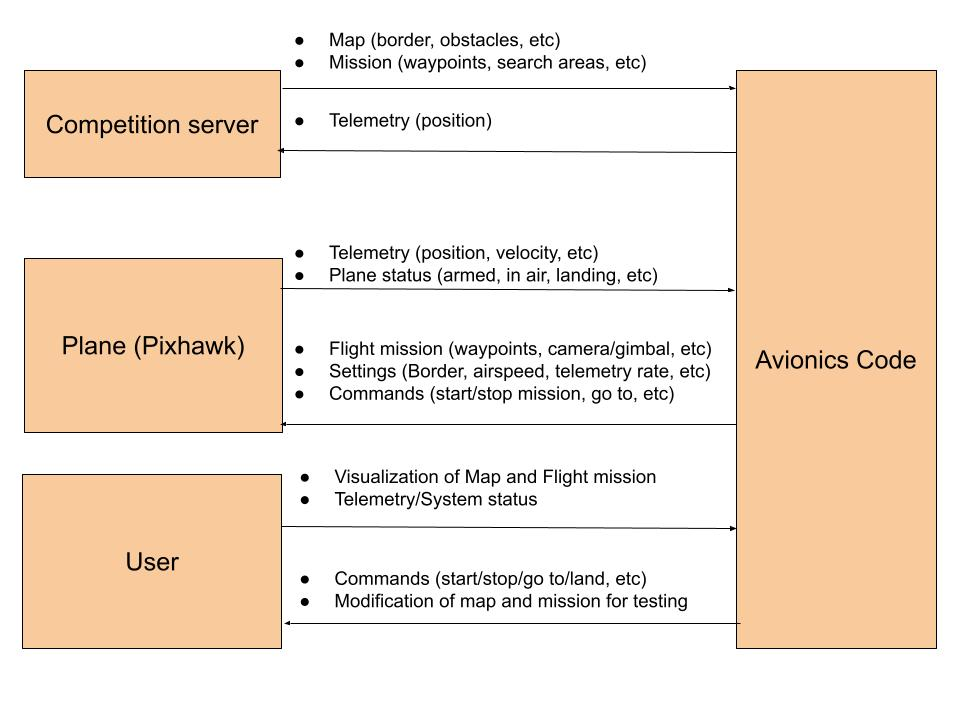
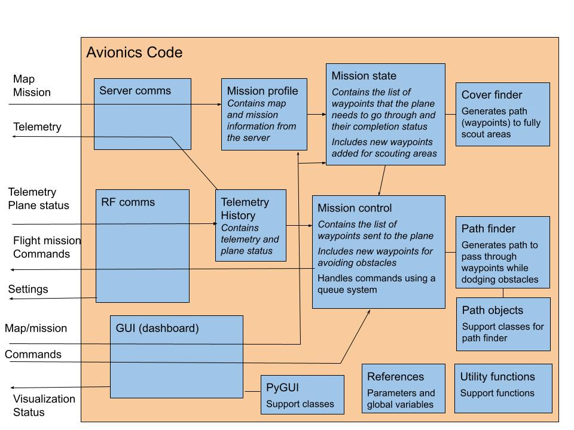
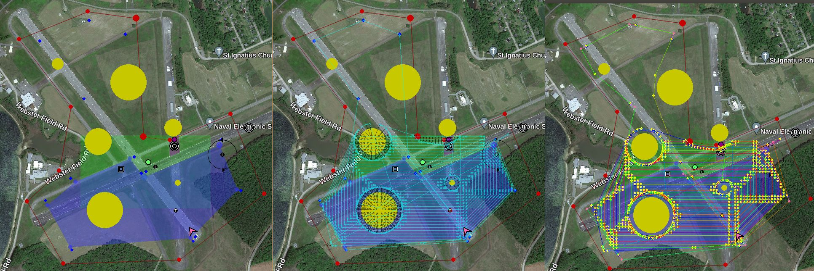
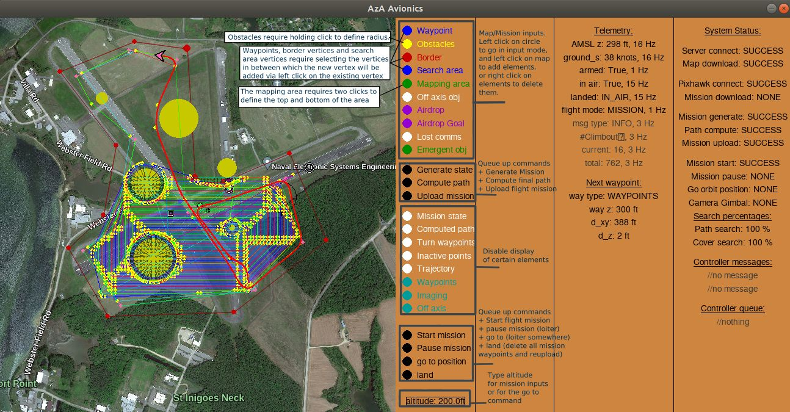

# AzA Avionics code 
Code of the Avionics team at the Arizona Autonomous Vehicles Club (University of Arizona)

Python code that handles server/plane communications and autonomous flying of the club's Pixhawk fixed-wings plane for the AUVSI SUAS competition

### Adapted avionics-relevant requirements for the competition
+ Request map and mission information from the server
+ Generate flight missions that allows the plane to pass through waypoints and scout areas for imaging while dodging static obstacles
+ Send flight missions to the plane
+ Get telemetry from the plane and send it to the server
+ Allow for visualization of the map, mission, flight, and system status

#### level 0 diagram

### Structure of the code
+ Server Comms requests the map and mission information from the server and stores it in Mission Profile
+ Mission State adds waypoints to the waypoint list of Mission Profile to allow for scouting search areas
+ Mission Control adds waypoints to the list of Mission State to allow for dodging obstacles
+ RF Comms converts the final list of waypoints into a flight mission (adds takeoff/landing etc.), and sends it to the Pixhawk
+ RF Comms also requests telemetry and plane status from the Pixhawk, and stores it in telemetry history, to be sent to the server by Server Comms and used by Mission Control for path finding
+ Avionics GUI displays the map/mission/telemetry/system status and allows for inputing commands or modifications to the map/mission for testing
+ Commands are handled by Mission Control through a queue system. Commands include both inner commands like path generation and plane commands like start/pause mission which are sent through RF Comms

#### level 1 diagram

#### Mission Stages : Mission Profile - Mission State - Mission Control's final path

### GUI (Made with PyGame)

### Algorithms

#### Cover finder
Creates a path to scout a polygonal area.
1. covers the polygonal area with a grid of waypoints and only keeps the waypoints inside the polygonal area
2. Traverses the grid of waypoints till all are included in the cover path with a spiral motion that minimizes direction change
The reason for the spiral motion is it suits the movement of a plane and makes obstacle avoidance easier

#### Single path finder
Finds n paths between two waypoints that allow for dodging static obstacles
1. Create a list of paths being searched and add to it one starting at the start node
2. Start loop that picks the shortest path from the paths being searched till n paths are found
3. Check if the shortest path is directly connectable to the end node, if yes, store it as a found path
4. Check if the shortest path can be connected to tangent nodes around static obstacles, if yes, extend it with them
5. Check if the shortest path can be connected to nodes on border vertices, if yes, extend it with them
6. For each path found, it is checked to see if the turns of the planes at each waypoint will not lead to collisions
7. For each path found, altitude of added waypoints is such as to keep a linear altitude change between the start and end
There are restrictions to only pick significantly different paths like paths not being allowed to bounce off obstacles

#### full path finder
Creates a path to pass through a list of waypoints while dodging static obstacles using recursion
1. Find n paths between waypoint i and waypoint i + 1
2. If waypoint i + 1 is the last waypoint, choose one of the path and return the found path
3. Else, pick one of the n paths and calls itself to continue it by finding n paths between waypoint i + 1 and waypoints i + 2
4. If the new iteration returns a path, return the found path
5. If the new iteration returns that no path was found, call it again with another of the n paths
6. If all iterations fail with all the n paths, return that no path was found
The reason for the recursive approach is that the curving of path which checks that plane turns at waypoints will not lead to collisions depends on the direction the waypoint is entered. So the curving check for the path between waypoint i and waypoint i + 1 depends on the path chosen between waypoint i - 1 and waypoint i
