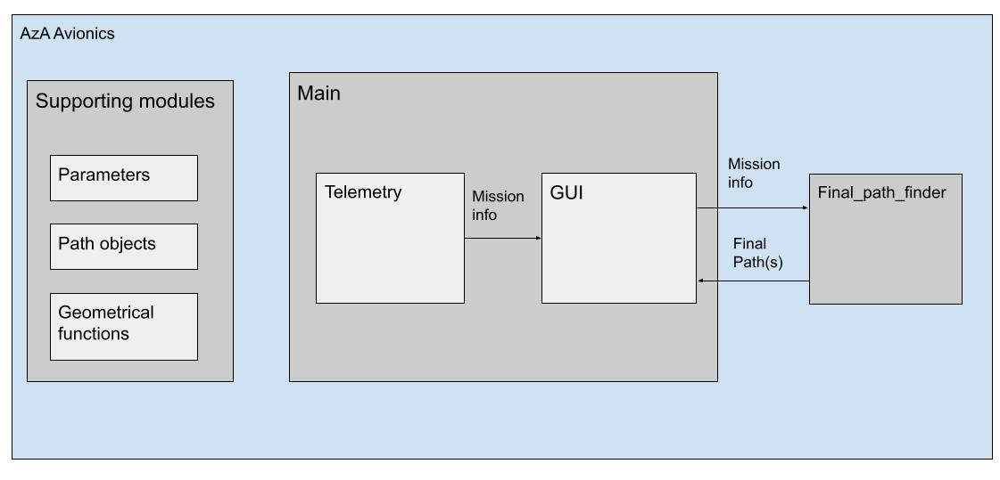

# AzA_Avionics  
Code of the Avionics team at the Arizona Autonomous Vehicles Club  
  
Python code that handles server communications and autonomous flying of the club's plane  
  
Status:  
> • Server/RF communications - hollow classes  
> • Decision making - hollow classes  
> • Pathfinding - Only 2d straight line pathfinding  

GUI instructions:  
> • Click on the buttons in the left-side menu to go into input-mode for a certain map object type  
> • While in an input mode, you can left-click to place an object or right-click to delete it    
> • altitude for inputs is to be written in the textbox before left-click
> • For area or path objects, you can select a vertex/waypoint to place a vertex/waypoint next to it  
> • For obstacles, hold click to select radius. For map, click twice to set the top and bottom of the area  
> • Right-click on a circle to delete all instances of a map object or reset them to map center  
> • Clear buttons can clear all map objects or clear all past plane telemetry history  
> • Reload buttons can reload mission profile or fetch plane telemetry  
> • Plane/ugv positions can be inputted using their buttons  
> • the generate button generates a mission plan based on the mission profile, then exports a path for it

